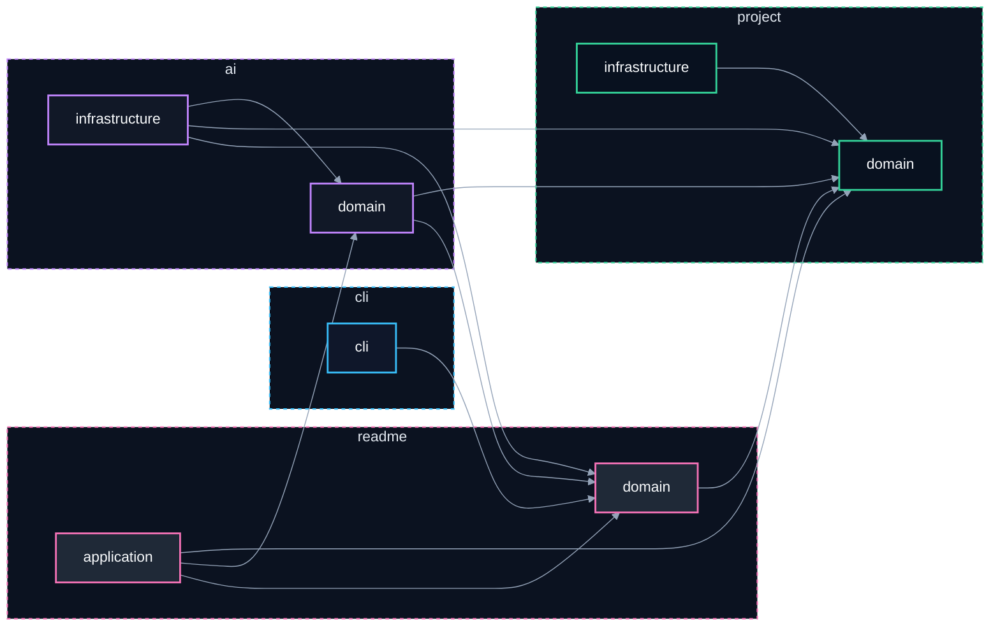

# 📝 @davidtorro/readme-gen

  

README.md generator for your projects. Creates a professional and attractive README quickly with optional local AI enrichment.

## ⚙️ Stack técnico

- 🔤 **Lenguajes**: TypeScript
- 🤖 **IA**: Ollama
- 🔧 **Tooling**: tsup

## 🏗️ Arquitectura



| Componente | Tecnología | Detalle |
| --- | --- | --- |
| `ai/domain` | ai | Entities, types and pure business logic |
| `ai/infrastructure` | ai | Adapters to the outside world (fs, HTTP…) |
| `cli` | cli | Command-line parsing and help |
| `main` | — | Composition root — wires every layer |
| `project/domain` | project | Entities, types and pure business logic |
| `project/infrastructure` | project | Adapters to the outside world (fs, HTTP…) |
| `readme/application` | readme | Use cases orchestrating the domain |
| `readme/domain` | readme | Entities, types and pure business logic |

## 🗂️ Estructura del proyecto

```
@davidtorro/readme-gen/
├── assets/
│   └── banner.svg
├── src/
│   ├── ai/
│   │   ├── domain/
│   │   │   ├── ai-generator.port.ts
│   │   │   ├── banner.prompt.ts
│   │   │   └── image-generator.port.ts
│   │   └── infrastructure/
│   │       ├── ai.config.ts
│   │       ├── ollama-image.client.ts
│   │       └── ollama.client.ts
│   ├── cli/
│   │   └── cli.parser.ts
│   ├── project/
│   │   ├── domain/
│   │   │   ├── project-scanner.port.ts
│   │   │   ├── project.builder.ts
│   │   │   ├── project.detectors.ts
│   │   │   └── project.interfaces.ts
│   │   └── infrastructure/
│   │       └── fs-project-scanner.ts
│   ├── readme/
│   │   ├── application/
│   │   │   └── generate-readme.use-case.ts
│   │   └── domain/
│   │       ├── i18n/
│   │       │   ├── en.json
│   │       │   ├── es.json
│   │       │   └── index.ts
│   │       ├── readme.architecture.ts
│   │       ├── readme.badges.ts
│   │       ├── readme.banner.ts
│   │       ├── readme.categories.ts
│   │       ├── readme.commands.ts
│   │       ├── readme.interfaces.ts
│   │       ├── readme.mermaid.ts
│   │       ├── readme.render.ts
│   │       ├── readme.sections.ts
│   │       └── readme.tree.ts
│   └── main.ts
├── .env.example
├── .gitignore
├── LICENSE
├── NOTICE
├── package-lock.json
├── package.json
├── README.md
├── tsconfig.json
└── tsup.config.ts
```

## 🛠️ Scripts

- `npm run build` — `tsup`
- `npm run dev` — `tsup --watch`
- `npm run typecheck` — `tsc`
- `npm run gen` — `npm run build && node dist/main.js`
- `npm run gen:all` — `npm run build && node dist/main.js banner --ai --force && node dist/main.js --ai --force`

## 🚀 Uso

Ejecútalo sin instalar, usando npx:

```bash
npx @davidtorro/readme-gen
```

O instálalo de forma global:

```bash
npm install -g @davidtorro/readme-gen
readme-gen
```

## 📋 Requisitos

- Node.js `>=20`

## 👤 Autor

Hecho por **David Torró**

## 📄 Licencia

Apache-2.0
