# 📝 @davidtorro/readme-gen

   

Generador de README.md profesional para proyectos Node.js. Analiza automáticamente el código fuente, detecta tecnologías y crea un documento atractivo con secciones estructuradas. Incluye enriquecimiento opcional con IA local usando Ollama para descripciones, características y arquitectura.

> 🚀 Crea README.md profesionales en segundos sin salir de tu terminal

## ⚙️ Tecnologías

- 🔤 **Lenguajes**: TypeScript
- 🧪 **Pruebas**: Vitest
- 🤖 **IA**: Ollama
- 🔧 **Herramientas**: tsup

## ✨ Características

- ✨ Genera README.md completo con secciones como descripción, características, instalación y uso
- 🔧 Detecta automáticamente tecnologías y dependencias del proyecto (TypeScript, Vitest, etc.)
- 🤖 Enriquece el contenido con IA local mediante Ollama para mejorar descripciones y arquitectura
- 🌐 Soporta múltiples idiomas: inglés y español, con sistema de traducciones escalable
- 📂 Analiza archivos .env.example para documentar variables de entorno del proyecto
- 🛠️ Comando CLI para generar banner SVG personalizado con soporte para IA

## 🏗️ Arquitectura

```mermaid
%%{init: {
    "theme": "base",
    "flowchart": { "curve": "basis", "nodeSpacing": 60, "rankSpacing": 90 },
    "themeVariables": {
        "primaryColor": "#1f2937",
        "primaryTextColor": "#f9fafb",
        "primaryBorderColor": "#60a5fa",
        "lineColor": "#94a3b8",
        "tertiaryColor": "#0f172a"
    }
}}%%

flowchart LR
    subgraph SG0["🤖 Motor de IA"]
        direction LR
        ollama["🧠 Ollama<br/>http://localhost:11434"]
    end
    subgraph SG1["⚙️ Procesamiento"]
        direction LR
        scanner["🔍 Escaneador de proyecto<br/>fs + fast-glob"]
        builder["🏗️ Constructor de información<br/>project.builder.ts"]
        ai_client["💬 Cliente IA<br/>ollama.client.ts"]
    end
    subgraph SG2["📄 Generación"]
        direction LR
        generator["📝 Generador de README<br/>generate-readme.use-case.ts"]
        renderer["🎨 Renderizador<br/>readme.banner.js"]
    end
    user["👤 Usuario"]
    user -- "comando CLI" --> scanner
    scanner -- "datos del proyecto" --> builder
    builder -- "info + código fuente" --> ai_client
    ai_client -- "HTTP" --> ollama
    ai_client -- "enriquecimiento" --> generator
    generator -- "datos estructurados" --> renderer

    classDef g0 fill:#0f172a,stroke:#38bdf8,color:#f8fafc,stroke-width:2px;
    class ollama g0;
    classDef g1 fill:#111827,stroke:#c084fc,color:#f8fafc,stroke-width:2px;
    class scanner,builder,ai_client g1;
    classDef g2 fill:#08111f,stroke:#34d399,color:#f8fafc,stroke-width:2px;
    class generator,renderer g2;
    classDef actor fill:#1f2937,stroke:#f59e0b,color:#fff7ed,stroke-width:2px,stroke-dasharray: 5 3;
    class user actor;
    style SG0 fill:#0b1220,stroke:#38bdf8,stroke-width:1.5px,stroke-dasharray: 4 4,color:#e2e8f0
    style SG1 fill:#0b1220,stroke:#c084fc,stroke-width:1.5px,stroke-dasharray: 4 4,color:#e2e8f0
    style SG2 fill:#0b1220,stroke:#34d399,stroke-width:1.5px,stroke-dasharray: 4 4,color:#e2e8f0
```



| Componente | Tecnología | Detalle |
| --- | --- | --- |
| `Escaneador de proyecto` | fs + fast-glob | Analiza el árbol de archivos del proyecto |
| `Constructor de información` | project.builder.ts | Construye la estructura de datos del proyecto |
| `Cliente IA` | ollama.client.ts | Comunica con el servidor Ollama para generar contenido |
| `Generador de README` | generate-readme.use-case.ts | Orquesta la generación del archivo README.md |
| `Renderizador` | readme.banner.js | Genera el banner SVG para el README |

## 🗂️ Estructura del proyecto

```
@davidtorro/readme-gen/
├── assets/                                       # Recursos del proyecto
│   └── banner.svg                                # Banner del proyecto
├── src/                                          # Código fuente principal
│   ├── ai/                                       # Lógica de inteligencia artificial
│   │   ├── domain/                               # Dominio de la IA
│   │   │   └── ai-generator.port.ts              # Interfaz generadora de IA
│   │   └── infrastructure/                       # Infraestructura de IA
│   │       ├── ai.config.test.ts                 # Pruebas de configuración de IA
│   │       ├── ai.config.ts                      # Configuración de IA
│   │       ├── ollama.client.test.ts             # Pruebas del cliente Ollama
│   │       └── ollama.client.ts                  # Cliente Ollama
│   ├── cli/                                      # Interfaz de línea de comandos
│   │   ├── cli.parser.test.ts                    # Pruebas del parser CLI
│   │   └── cli.parser.ts                         # Parser de comandos CLI
│   ├── project/                                  # Lógica del proyecto
│   │   ├── domain/                               # Dominio del proyecto
│   │   │   ├── project-scanner.port.ts           # Interfaz escaneadora de proyecto
│   │   │   ├── project.builder.test.ts           # Pruebas del constructor de proyecto
│   │   │   ├── project.builder.ts                # Constructor de proyecto
│   │   │   ├── project.detectors.ts              # Detectores de proyecto
│   │   │   └── project.interfaces.ts             # Interfaces del proyecto
│   │   └── infrastructure/                       # Infraestructura del proyecto
│   │       ├── fs-project-scanner.test.ts        # Pruebas del escaneador FS
│   │       └── fs-project-scanner.ts             # Escaneador de proyecto FS
│   ├── readme/                                   # Generación de README
│   │   ├── application/                          # Casos de uso de README
│   │   │   ├── generate-readme.use-case.test.ts  # Pruebas del caso de uso README
│   │   │   └── generate-readme.use-case.ts       # Caso de uso generación README
│   │   └── domain/                               # Dominio de README
│   │       ├── i18n/                             # Internacionalización de README
│   │       │   ├── en.json                       # Traducciones en inglés
│   │       │   ├── es.json                       # Traducciones en español
│   │       │   └── index.ts                      # Índice de traducciones
│   │       ├── readme.badges.ts                  # Badges del README
│   │       ├── readme.banner.test.ts             # Pruebas del banner README
│   │       ├── readme.banner.ts                  # Banner del README
│   │       ├── readme.categories.ts              # Categorías del README
│   │       ├── readme.commands.ts                # Comandos del README
│   │       ├── readme.interfaces.ts              # Interfaces del README
│   │       ├── readme.mermaid.ts                 # Diagramas Mermaid
│   │       ├── readme.render.test.ts             # Pruebas de renderizado README
│   │       ├── readme.render.ts                  # Renderizado del README
│   │       ├── readme.sections.ts                # Secciones del README
│   │       └── readme.tree.ts                    # Árbol del proyecto
│   └── main.ts                                   # Punto de entrada CLI
├── .env.example
├── .gitignore
├── LICENSE
├── NOTICE
├── package-lock.json
├── package.json
├── README.md
├── tsconfig.json
└── tsup.config.ts
```

## 🧪 Pruebas

Este proyecto incluye pruebas con Vitest.

```bash
npm run test
```

## 🚀 Uso

Ejecútalo sin instalarlo con npx:

```bash
npx @davidtorro/readme-gen
```

O instálalo de forma global:

```bash
npm install -g @davidtorro/readme-gen
readme-gen
```

## 📋 Requisitos

- Node.js `>=20`

## 🔐 Variables de entorno

| Variable | Descripción |
| --- | --- |
| `OLLAMA_MODEL` | Modelo de Ollama para analizar código y redactar el README |
| `OLLAMA_URL` | URL del servidor Ollama |

## 👤 Autor

Hecho por **David Torró**

## 📄 Licencia

Apache-2.0
