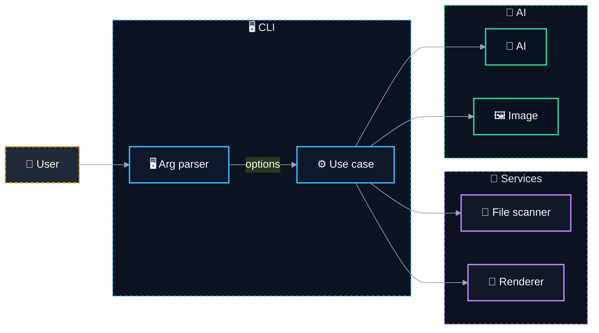

# 📝 @davidtorro/readme-gen

  

A README.md generator for your projects. Creates a professional and attractive README quickly with optional local AI enrichment.

> 🤖 Generate professional READMEs with AI enrichment, all locally and privately.

## ⚙️ Tech Stack

- 🔤 **Languages**: TypeScript
- 🤖 **AI**: Ollama
- 🔧 **Tooling**: tsup

## ✨ Features

- 🤖 Generates README.md with AI-powered content suggestions using Ollama
- 📁 Automatically scans your project structure to build an organized README
- 🎨 Adds badges, categories, and Mermaid diagrams for visual appeal
- 🌍 Supports multiple languages with built-in i18n support
- 🚀 Pre-configured npm scripts for building, typechecking, and generating READMEs
- ⚙️ Lightweight and modular architecture with clear separation of concerns

## 🏗️ Architecture



| Component | Technology | Details |
| --- | --- | --- |
| `cli` | TypeScript | Parses arguments |
| `scanner` | Node.js | Reads project files |
| `renderer` | TypeScript | Generates README content |
| `ai` | Ollama | Generates text content |
| `image` | Ollama | Generates banner image |
| `i18n` | TypeScript | Supports multiple languages |
| `config` | TypeScript | Handles AI configuration |

## 🗂️ Project Structure

```
@davidtorro/readme-gen/
├── assets/                                  # Static assets like banner image
│   └── banner.svg                           # Banner image for README
├── src/                                     # Source code directory
│   ├── ai/                                  # AI-related functionality
│   │   ├── domain/                          # AI domain models and interfaces
│   │   │   ├── ai-generator.port.ts         # AI generator interface
│   │   │   ├── banner.prompt.ts             # Banner prompt template
│   │   │   └── image-generator.port.ts      # Image generator interface
│   │   └── infrastructure/                  # AI infrastructure implementations
│   │       ├── ai.config.ts                 # AI configuration
│   │       ├── ollama-image.client.ts       # Ollama image client
│   │       └── ollama.client.ts             # Ollama client
│   ├── cli/                                 # Command line interface
│   │   └── cli.parser.ts                    # CLI argument parsing
│   ├── project/                             # Project structure and metadata
│   │   ├── domain/
│   │   │   ├── project-scanner.port.ts      # Project scanner interface
│   │   │   ├── project.builder.ts           # Project builder
│   │   │   ├── project.detectors.ts         # Project detectors
│   │   │   └── project.interfaces.ts        # Project interfaces
│   │   └── infrastructure/
│   │       └── fs-project-scanner.ts        # File system project scanner
│   ├── readme/                              # README generation logic
│   │   ├── application/                     # Application layer for README generation
│   │   │   └── generate-readme.use-case.ts  # Generate README use case
│   │   └── domain/                          # README domain models and logic
│   │       ├── i18n/                        # Internationalization files for README
│   │       │   ├── en.json                  # English i18n for README
│   │       │   ├── es.json                  # Spanish i18n for README
│   │       │   └── index.ts                 # i18n index and exports
│   │       ├── readme.badges.ts             # README badges logic
│   │       ├── readme.banner.ts             # README banner logic
│   │       ├── readme.categories.ts         # README categories logic
│   │       ├── readme.commands.ts           # README commands logic
│   │       ├── readme.interfaces.ts         # README interfaces
│   │       ├── readme.mermaid.ts            # README Mermaid logic
│   │       ├── readme.render.ts             # README rendering logic
│   │       ├── readme.sections.ts           # README sections logic
│   │       └── readme.tree.ts               # README tree logic
│   └── main.ts                              # Main entry point for application
├── .env.example                             # Example environment variables
├── .gitignore                               # Git ignore configuration
├── LICENSE                                  # Project license file
├── NOTICE                                   # Project notice file
├── package-lock.json                        # Node package lock file
├── package.json                             # Project metadata and dependencies
├── README.md                                # Project root README file
├── tsconfig.json                            # TypeScript configuration
└── tsup.config.ts                           # Tsup bundler configuration
```

## 📦 Installation

```bash
npm install
```

## 🛠️ Scripts

- `npm run build` — `tsup`
- `npm run dev` — `tsup --watch`
- `npm run typecheck` — `tsc`
- `npm run prepublishOnly` — `npm run build`
- `npm run gen` — `npm run build && node dist/main.js`
- `npm run gen:all` — `npm run build && node dist/main.js banner --ai --force && node dist/main.js --ai --force`

## 📄 License

Apache-2.0
