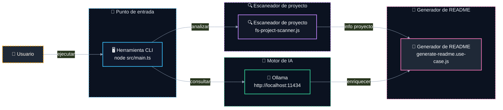

# 📝 @davidtorro/readme-gen

   

Generador de README.md profesional para proyectos Node.js. Analiza automáticamente el código fuente, detecta tecnologías y crea un documento atractivo con secciones estructuradas. Incluye enriquecimiento opcional con IA local usando Ollama para descripciones, características y arquitectura.

> 🚀 Crea README.md profesionales en segundos sin salir de tu terminal

## ⚙️ Tecnologías

- 🔤 **Lenguajes**: TypeScript
- 🧪 **Pruebas**: Vitest
- 🤖 **IA**: Ollama
- 🔧 **Herramientas**: tsup

## ✨ Características

- ✨ Genera README.md completo con secciones como descripción, características, instalación y uso
- 🔧 Detecta automáticamente tecnologías y dependencias del proyecto (TypeScript, Vitest, etc.)
- 🤖 Enriquece el contenido con IA local mediante Ollama para mejorar descripciones y arquitectura
- 🌐 Soporta múltiples idiomas: inglés y español, con sistema de traducciones escalable
- 📂 Analiza archivos .env.example para documentar variables de entorno del proyecto
- 🛠️ Comando CLI para generar banner SVG personalizado con soporte para IA

## 🏗️ Arquitectura



| Componente | Tecnología | Detalle |
| --- | --- | --- |
| `Herramienta CLI` | TypeScript + Node.js | Punto de entrada principal del generador de README |
| `Escaneador de proyecto` | fast-glob + fs | Analiza el árbol de archivos y dependencias del proyecto |
| `Motor de IA` | Ollama + modelo qwen3-coder:30b | Servicio de lenguaje para generar contenido del README |
| `Generador de README` | TypeScript | Construye el archivo README.md con datos analizados y generados por IA |## 🧪 Pruebas

Este proyecto incluye pruebas con Vitest.

```bash
npm run test
```

## 🚀 Uso

Ejecútalo sin instalarlo con npx:

```bash
npx @davidtorro/readme-gen
```

O instálalo de forma global:

```bash
npm install -g @davidtorro/readme-gen
readme-gen
```

## 📋 Requisitos

- Node.js `>=20`

## 🔐 Variables de entorno

| Variable | Descripción |
| --- | --- |
| `OLLAMA_MODEL` | Modelo de Ollama para analizar código y redactar el README |
| `OLLAMA_URL` | URL del servidor Ollama |

## 👤 Autor

Hecho por **David Torró**

## 📄 Licencia

Apache-2.0
