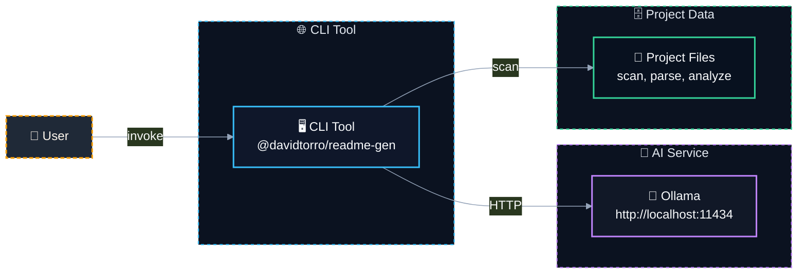

# 📝 @davidtorro/readme-gen

   

A CLI tool that generates professional README.md files for your projects by analyzing source code and dependencies. It supports optional AI enrichment using local Ollama models to enhance content, and offers multi-language support with English and Spanish translations.

> 🔒 Generates READMEs locally without sending code to external services, keeping your project data private.

## ⚙️ Tech Stack

- 🔤 **Languages**: TypeScript
- 🧪 **Testing**: Vitest
- 🤖 **AI**: Ollama
- 🔧 **Tooling**: tsup

## ✨ Features

- ✨ Analyzes project structure, dependencies, and code to auto-generate structured README content
- 🤖 Optionally enriches README with AI-powered descriptions, features, and architecture diagrams using local Ollama models
- 🌐 Supports bilingual README generation in English and Spanish with configurable translation files
- 🛠️ Provides commands for generating banners, full READMEs, or localized versions with or without AI
- 🔧 Uses TypeScript and Vitest for type safety and testing; built with tsup for efficient bundling
- 📄 Detects package managers, tech stack categories, environment variables, and HTTP endpoints automatically

## 🏗️ Architecture



| Component | Technology | Details |
| --- | --- | --- |
| `CLI Entry Point` | TypeScript + Node.js | Main CLI executable using tsup for bundling |
| `Project Scanner` | fast-glob + FS | Scans project files and extracts metadata from package.json, imports, sources |
| `AI Generator` | Ollama API | Uses Ollama model to enrich README content with AI-generated descriptions and architecture |
| `Translation Engine` | i18n JSON files | Provides localized strings for README sections using English and Spanish |

## 🗂️ Project Structure

```
@davidtorro/readme-gen/
├── assets/                                       # Project assets
│   └── banner.svg                                # Project banner image
├── src/                                          # Source code
│   ├── ai/                                       # AI integration layer
│   │   ├── domain/                               # AI domain logic
│   │   │   └── ai-generator.port.ts              # AI generation interface
│   │   └── infrastructure/                       # AI infrastructure
│   │       ├── ai.config.test.ts                 # AI config unit tests
│   │       ├── ai.config.ts                      # AI configuration
│   │       ├── ollama.client.test.ts             # Ollama client tests
│   │       └── ollama.client.ts                  # Ollama API client
│   ├── cli/                                      # Command-line interface
│   │   ├── cli.parser.test.ts                    # CLI parser unit tests
│   │   └── cli.parser.ts                         # CLI argument parsing
│   ├── project/                                  # Project scanning and analysis
│   │   ├── domain/                               # Project domain logic
│   │   │   ├── project-scanner.port.ts           # Project scanning interface
│   │   │   ├── project.builder.test.ts           # Project builder tests
│   │   │   ├── project.builder.ts                # Project data builder
│   │   │   ├── project.detectors.ts              # Project file detectors
│   │   │   └── project.interfaces.ts             # Project interfaces
│   │   └── infrastructure/                       # Project file system scanning
│   │       ├── fs-project-scanner.test.ts        # FS scanner unit tests
│   │       └── fs-project-scanner.ts             # File system project scanner
│   ├── readme/                                   # README generation components
│   │   ├── application/                          # README generation use cases
│   │   │   ├── generate-readme.use-case.test.ts  # Generate README use case tests
│   │   │   └── generate-readme.use-case.ts       # README generation logic
│   │   └── domain/                               # README domain logic
│   │       ├── i18n/                             # Internationalization files
│   │       │   ├── en.json                       # English translations
│   │       │   ├── es.json                       # Spanish translations
│   │       │   └── index.ts                      # I18n export index
│   │       ├── readme.badges.ts                  # README badges rendering
│   │       ├── readme.banner.test.ts             # README banner unit tests
│   │       ├── readme.banner.ts                  # README banner handling
│   │       ├── readme.categories.ts              # README categories logic
│   │       ├── readme.commands.ts                # README command sections
│   │       ├── readme.interfaces.ts              # README interfaces
│   │       ├── readme.mermaid.ts                 # Mermaid diagram rendering
│   │       ├── readme.render.test.ts             # README render unit tests
│   │       ├── readme.render.ts                  # README Markdown rendering
│   │       ├── readme.sections.ts                # README section handling
│   │       └── readme.tree.ts                    # Project file tree display
│   └── main.ts                                   # CLI entry point
├── .env.example
├── .gitignore
├── LICENSE
├── NOTICE
├── package-lock.json
├── package.json
├── README.md
├── tsconfig.json
└── tsup.config.ts
```

## 🛠️ Scripts

- `npm run build` — `tsup`
- `npm run dev` — `tsup --watch`
- `npm run typecheck` — `tsc`
- `npm run test` — `vitest run`
- `npm run verify` — `npm run typecheck && npm test && npm run build`
- `npm run cli -- --help` — builds and shows the CLI help
- `npm run banner` — `npm run build && node dist/main.js banner --force`
- `npm run readme` — `npm run build && node dist/main.js --force`
- `npm run readme:ai` — `npm run build && node dist/main.js --ai --force`
- `npm run readme:es` — `npm run build && node dist/main.js es --force`
- `npm run readme:es:ai` — `npm run build && node dist/main.js es --ai --force`
- `npm run all` — `npm run banner && npm run readme:ai`
- `npm run gen` — `npm run readme`
- `npm run gen:all` — `npm run all`

## 🧪 Testing

This project includes testing configuration with Vitest.

```bash
npm run test
```

## 🚀 Usage

### Quick start

Preview the generated README before writing a file:

```bash
npx @davidtorro/readme-gen --dry-run
```

Generate or overwrite `README.md` in the current project:

```bash
npx @davidtorro/readme-gen --force
```

### Commands

| Command | Description |
| --- | --- |
| `readme-gen --help` | Show all commands and options in English. |
| `readme-gen es --help` | Show all commands and options in Spanish. |
| `readme-gen --dry-run` | Print the English README without writing a file. |
| `readme-gen es --force` | Generate a Spanish `README.md`. |
| `readme-gen --ai --force` | Enrich the README with local Ollama AI. |
| `readme-gen --output docs/README.md --force` | Generate the README at a custom path. |
| `readme-gen banner --dry-run` | Print the local SVG banner without writing it. |
| `readme-gen banner --force` | Generate `assets/banner.svg`. |

`--force` is required only when the output file already exists. `--dry-run` never writes files.

### Installation

Run without installing:

```bash
npx @davidtorro/readme-gen --help
npx @davidtorro/readme-gen es --help
```

Or install it globally:

```bash
npm install -g @davidtorro/readme-gen
readme-gen --help
readme-gen es --help
```

### Development

From this repository, pass arguments through npm with a second `--`:

```bash
npm run cli -- --help
npm run cli -- es --help
npm run cli -- es --dry-run
```

## 📋 Requirements

- Node.js `>=20`

## 🔐 Environment Variables

| Variable | Description |
| --- | --- |
| `OLLAMA_MODEL` | Modelo de Ollama para analizar código y redactar el README |
| `OLLAMA_URL` | URL del servidor Ollama |

## 👤 Author

Made by **David Torró**

## 📄 License

Apache-2.0
