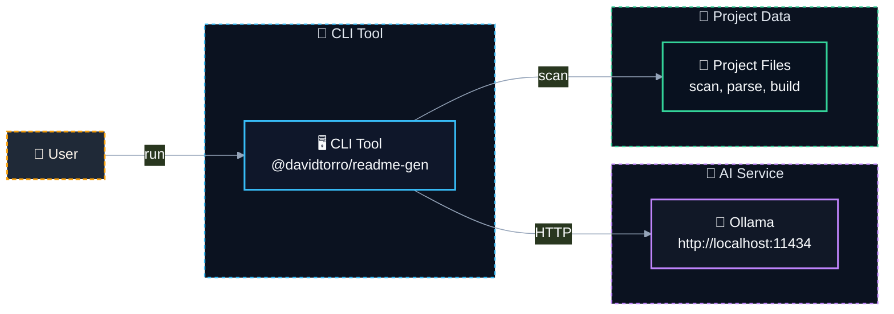

# 📝 @davidtorro/readme-gen

   

A CLI tool that generates professional README.md files for your projects by analyzing source code and package metadata. It supports optional AI enrichment using local Ollama models to enhance content like descriptions, features, and architecture diagrams.

> ⚡ Generates professional READMEs quickly with optional local AI enrichment, no internet required.

## ⚙️ Tech Stack

- 🔤 **Languages**: TypeScript
- 🧪 **Testing**: Vitest
- 🤖 **AI**: Ollama
- 🔧 **Tooling**: tsup

## ✨ Features

- ✨ Analyzes project structure, dependencies, and source code to build a comprehensive README
- 🤖 Optionally enriches content with AI powered by local Ollama instance
- 📁 Supports multiple package managers (npm, pnpm, yarn, bun) and detects tech stack automatically
- 🎨 Generates architecture diagrams in Mermaid format from real imports and code analysis
- 🌐 Internationalized with English and Spanish support for UI strings and documentation
- 🛠️ Fully typed with TypeScript and tested using Vitest for reliability

## 🏗️ Architecture



| Component | Technology | Details |
| --- | --- | --- |
| `CLI Entry Point` | TypeScript + Node.js | Main CLI script that parses args and orchestrates the flow. |
| `Project Scanner` | fast-glob | Scans project files and extracts metadata from package.json and source code. |
| `AI Generator` | Ollama + qwen3-coder:30b | Generates README content using local LLM via HTTP API. |
| `Translation Engine` | i18n JSON files | Provides localized messages for CLI output and generated README. |

## 🗂️ Project Structure

```
@davidtorro/readme-gen/
├── assets/                                       # Project assets directory
│   ├── architecture.mmd                          # Architecture diagram source
│   ├── architecture.svg                          # Architecture diagram image
│   └── banner.svg                                # Project banner image
├── src/                                          # Source code root
│   ├── ai/                                       # AI-related modules
│   │   ├── domain/                               # AI domain interfaces
│   │   │   └── ai-generator.port.ts              # AI generation interface
│   │   └── infrastructure/                       # AI infrastructure implementations
│   │       ├── ai.config.test.ts                 # AI config unit tests
│   │       ├── ai.config.ts                      # AI configuration loader
│   │       ├── ollama.client.test.ts             # Ollama client tests
│   │       └── ollama.client.ts                  # Ollama API client
│   ├── cli/                                      # Command-line interface
│   │   ├── cli.parser.test.ts                    # CLI parser unit tests
│   │   └── cli.parser.ts                         # CLI argument parsing
│   ├── project/                                  # Project scanning and analysis
│   │   ├── domain/                               # Project domain logic
│   │   │   ├── project-scanner.port.ts           # Project scanner interface
│   │   │   ├── project.builder.test.ts           # Project builder tests
│   │   │   ├── project.builder.ts                # Project data builder
│   │   │   ├── project.detectors.ts              # Project file detectors
│   │   │   └── project.interfaces.ts             # Project domain interfaces
│   │   └── infrastructure/                       # Project scanning implementations
│   │       ├── fs-project-scanner.test.ts        # File system scanner tests
│   │       └── fs-project-scanner.ts             # File system project scanner
│   ├── readme/                                   # README generation components
│   │   ├── application/                          # Use cases for README generation
│   │   │   ├── generate-readme.use-case.test.ts  # Use case unit tests
│   │   │   └── generate-readme.use-case.ts       # Generate README use case
│   │   └── domain/                               # README domain logic
│   │       ├── i18n/                             # Internationalization files
│   │       │   ├── en.json                       # English translations
│   │       │   ├── es.json                       # Spanish translations
│   │       │   └── index.ts                      # I18n export module
│   │       ├── readme.architecture.test.ts       # Architecture rendering tests
│   │       ├── readme.architecture.ts            # Architecture diagram generator
│   │       ├── readme.badges.ts                  # README badges handling
│   │       ├── readme.banner.test.ts             # Banner rendering tests
│   │       ├── readme.banner.ts                  # README banner component
│   │       ├── readme.categories.ts              # Project categories logic
│   │       ├── readme.commands.ts                # Command usage section
│   │       ├── readme.interfaces.ts              # README domain interfaces
│   │       ├── readme.mermaid.ts                 # Mermaid diagram rendering
│   │       ├── readme.render.test.ts             # README rendering tests
│   │       ├── readme.render.ts                  # README markdown renderer
│   │       ├── readme.sections.ts                # README sections logic
│   │       └── readme.tree.ts                    # Project file tree display
│   └── main.ts                                   # CLI entry point
├── .env.example                                  # Environment variables example
├── .gitignore                                    # Git ignore rules
├── LICENSE                                       # Project license file
├── NOTICE                                        # Legal notices
├── package-lock.json                             # Dependency lock file
├── package.json                                  # Project metadata and scripts
├── README.md                                     # Main project documentation
├── tsconfig.json                                 # TypeScript configuration
└── tsup.config.ts                                # Build configuration
```

## 🧪 Testing

This project includes testing configuration with Vitest.

```bash
npm run test
```

## 🚀 Usage

Run it without installing, using npx:

```bash
npx @davidtorro/readme-gen
```

Or install it globally:

```bash
npm install -g @davidtorro/readme-gen
readme-gen
```

## 📋 Requirements

- Node.js `>=20`

## 🔐 Environment Variables

| Variable | Description |
| --- | --- |
| `OLLAMA_MODEL` | Modelo de Ollama para analizar código y redactar el README |
| `OLLAMA_URL` | URL del servidor Ollama |

## 👤 Author

Made by **David Torró**

## 📄 License

Apache-2.0
