# 📝 @davidtorro/readme-gen

   

Generador de README.md profesional y atractivo para proyectos, que puede enriquecer el contenido con IA local mediante Ollama. Detecta automáticamente tecnologías, scripts, dependencias y estructura del proyecto para crear un documento completo y bien organizado.

> ⚡ Genera README.md profesionales en segundos usando IA local, sin enviar datos a servidores externos.

## ⚙️ Tecnologías

- 🔤 **Lenguajes**: TypeScript
- 🧪 **Pruebas**: Vitest
- 🤖 **IA**: Ollama
- 🔧 **Herramientas**: tsup

## ✨ Características

- ✨ Genera un README.md completo con secciones estructuradas como descripción, características, instalación y arquitectura
- 🤖 Enriquece el contenido del README usando IA local a través de Ollama, con soporte para múltiples idiomas (español e inglés)
- 🔍 Escanea automáticamente el proyecto para detectar tecnologías, scripts, dependencias y configuraciones desde package.json y .env.example
- 📂 Soporta comandos CLI como `banner` para generar un banner SVG o `--IA` para enriquecer el contenido del README
- 🔧 Configuración flexible mediante variables de entorno (OLLAMA_URL y OLLAMA_MODEL) sin necesidad de archivos de configuración adicionales
- 🧪 Incluye pruebas unitarias y de integración con Vitest, y está construido con TypeScript para una mejor experiencia de desarrollo

## 🏗️ Arquitectura

```mermaid
%%{init: {
    "theme": "base",
    "flowchart": { "curve": "basis", "nodeSpacing": 60, "rankSpacing": 90 },
    "themeVariables": {
        "primaryColor": "#1f2937",
        "primaryTextColor": "#f9fafb",
        "primaryBorderColor": "#60a5fa",
        "lineColor": "#94a3b8",
        "tertiaryColor": "#0f172a"
    }
}}%%

flowchart LR
    subgraph SG0["📌 Entrada CLI"]
        direction LR
        cli["⚙️ Herramienta CLI<br/>main.ts"]
    end
    subgraph SG1["🔍 Escaneo de Proyecto"]
        direction LR
        scanner["🔍 Escaneador de proyecto<br/>fs-project-scanner.js"]
    end
    subgraph SG2["🧠 Lógica de Negocio"]
        direction LR
        usecase["🧩 Caso de uso<br/>generate-readme.use-case.js"]
    end
    subgraph SG3["🤖 Inteligencia Artificial"]
        direction LR
        ai["🤖 Motor de IA<br/>Ollama (qwen3-coder:30b)"]
    end
    subgraph SG4["📄 Generación README"]
        direction LR
        renderer["📝 Renderizador README<br/>readme.template.js"]
    end
    user["👤 Usuario"]
    user -- "comando" --> cli
    cli -- "lectura de archivos" --> scanner
    scanner -- "info del proyecto" --> usecase
    usecase -- "solicitud IA" --> ai
    usecase -- "datos para renderizar" --> renderer

    classDef g0 fill:#0f172a,stroke:#38bdf8,color:#f8fafc,stroke-width:2px;
    class cli g0;
    classDef g1 fill:#111827,stroke:#c084fc,color:#f8fafc,stroke-width:2px;
    class scanner g1;
    classDef g2 fill:#08111f,stroke:#34d399,color:#f8fafc,stroke-width:2px;
    class usecase g2;
    classDef g3 fill:#1f2937,stroke:#f472b6,color:#f8fafc,stroke-width:2px;
    class ai g3;
    classDef g4 fill:#0f172a,stroke:#38bdf8,color:#f8fafc,stroke-width:2px;
    class renderer g4;
    classDef actor fill:#1f2937,stroke:#f59e0b,color:#fff7ed,stroke-width:2px,stroke-dasharray: 5 3;
    class user actor;
    style SG0 fill:#0b1220,stroke:#38bdf8,stroke-width:1.5px,stroke-dasharray: 4 4,color:#e2e8f0
    style SG1 fill:#0b1220,stroke:#c084fc,stroke-width:1.5px,stroke-dasharray: 4 4,color:#e2e8f0
    style SG2 fill:#0b1220,stroke:#34d399,stroke-width:1.5px,stroke-dasharray: 4 4,color:#e2e8f0
    style SG3 fill:#0b1220,stroke:#f472b6,stroke-width:1.5px,stroke-dasharray: 4 4,color:#e2e8f0
    style SG4 fill:#0b1220,stroke:#38bdf8,stroke-width:1.5px,stroke-dasharray: 4 4,color:#e2e8f0
```



| Componente | Tecnología | Detalle |
| --- | --- | --- |
| `Herramienta CLI` | TypeScript + Vitest + tsup | Punto de entrada principal con análisis de argumentos |
| `Escaneador de proyecto` | Node.js fs + fast-glob | Detecta archivos, imports, paquetes y variables de entorno |
| `Motor de IA` | Ollama | Interfaz HTTP para modelos LLM como qwen3-coder:30b |
| `Generador de README` | Plantillas + Traducciones | Construye el contenido usando datos del proyecto y IA |

## 🗂️ Estructura del proyecto

```
@davidtorro/readme-gen/
├── assets/                                       # Recursos del proyecto
│   └── banner.svg                                # Banner del proyecto
├── src/                                          # Código fuente principal
│   ├── ai/                                       # Lógica de inteligencia artificial
│   │   ├── domain/                               # Dominio de la IA
│   │   │   └── ai-generator.port.ts              # Interfaz generadora IA
│   │   └── infrastructure/                       # Infraestructura de IA
│   │       ├── ai.config.test.ts                 # Pruebas de configuración IA
│   │       ├── ai.config.ts                      # Configuración IA
│   │       ├── ollama.client.test.ts             # Pruebas del cliente Ollama
│   │       └── ollama.client.ts                  # Cliente Ollama
│   ├── cli/                                      # Interfaz de línea de comandos
│   │   ├── cli.parser.test.ts                    # Pruebas del parser CLI
│   │   └── cli.parser.ts                         # Parser de comandos CLI
│   ├── project/                                  # Lógica del proyecto
│   │   ├── domain/                               # Dominio del proyecto
│   │   │   ├── project-scanner.port.ts           # Interfaz escaneadora de proyecto
│   │   │   ├── project.builder.test.ts           # Pruebas del constructor de proyecto
│   │   │   ├── project.builder.ts                # Constructor de proyecto
│   │   │   ├── project.detectors.ts              # Detectores de proyecto
│   │   │   └── project.interfaces.ts             # Interfaces del proyecto
│   │   └── infrastructure/                       # Infraestructura del proyecto
│   │       ├── fs-project-scanner.test.ts        # Pruebas del escaneador FS
│   │       └── fs-project-scanner.ts             # Escaneador de proyecto FS
│   ├── readme/                                   # Generación de README
│   │   ├── application/                          # Casos de uso de README
│   │   │   ├── generate-readme.use-case.test.ts  # Pruebas del caso de uso README
│   │   │   └── generate-readme.use-case.ts       # Caso de uso generación README
│   │   └── domain/                               # Dominio de README
│   │       ├── i18n/                             # Internacionalización de README
│   │       │   ├── en.json                       # Traducciones inglés
│   │       │   ├── es.json                       # Traducciones español
│   │       │   └── index.ts                      # Índice de traducciones
│   │       ├── readme.badges.ts                  # Badges del README
│   │       ├── readme.banner.test.ts             # Pruebas del banner README
│   │       ├── readme.banner.ts                  # Banner del README
│   │       ├── readme.categories.ts              # Categorías del README
│   │       ├── readme.commands.ts                # Comandos del README
│   │       ├── readme.interfaces.ts              # Interfaces del README
│   │       ├── readme.mermaid.ts                 # Diagramas Mermaid del README
│   │       ├── readme.render.test.ts             # Pruebas de renderizado README
│   │       ├── readme.render.ts                  # Renderizado del README
│   │       ├── readme.sections.ts                # Secciones del README
│   │       └── readme.tree.ts                    # Árbol del proyecto en README
│   └── main.ts                                   # Punto de entrada CLI
├── .env.example
├── .gitignore
├── LICENSE
├── NOTICE
├── package-lock.json
├── package.json
├── README.md
├── tsconfig.json
└── tsup.config.ts
```

## 🧪 Pruebas

Este proyecto incluye pruebas con Vitest.

```bash
npm run test
```

## 🚀 Uso

Ejecútalo sin instalarlo con npx:

```bash
npx @davidtorro/readme-gen
```

O instálalo de forma global:

```bash
npm install -g @davidtorro/readme-gen
readme-gen
```

## 📋 Requisitos

- Node.js `>=20`

## 🔐 Variables de entorno

| Variable | Descripción |
| --- | --- |
| `OLLAMA_MODEL` | Modelo de Ollama para analizar código y redactar el README |
| `OLLAMA_URL` | URL del servidor Ollama |

## 👤 Autor

Hecho por **David Torró**

## 📄 Licencia

Apache-2.0
