# 📝 @davidtorro/readme-gen

   

Generador de README.md profesional y atractivo para proyectos. Crea documentos completos rápidamente, con posibilidad de enriquecimiento local mediante IA para personalizar el contenido y el banner.

> ⚡ Velocidad y precisión al generar documentación profesional sin necesidad de conexión a internet.

## ⚙️ Stack técnico

- 🔤 **Lenguajes**: TypeScript
- 🧪 **Testing**: Vitest
- 🤖 **IA**: Ollama
- 🔧 **Tooling**: tsup

## ✨ Características

- ✨ Genera un README.md completo automáticamente analizando tu proyecto
- 🤖 Opcionalmente usa IA local (Ollama) para mejorar el contenido y el banner
- 🎨 Crea un banner animado vectorial con diseño personalizado basado en la IA
- 🛠️ Soporta múltiples lenguajes de programación y tecnologías detectadas automáticamente
- 🌐 Genera secciones como arquitectura, comandos, badges y categorías técnicas
- 🌐 Traducciones en inglés y español para el contenido del README

## 🏗️ Arquitectura

```mermaid
%%{init: {
    "theme": "base",
    "flowchart": { "curve": "basis", "nodeSpacing": 60, "rankSpacing": 90 },
    "themeVariables": {
        "primaryColor": "#1f2937",
        "primaryTextColor": "#f9fafb",
        "primaryBorderColor": "#60a5fa",
        "lineColor": "#94a3b8",
        "tertiaryColor": "#0f172a"
    }
}}%%

flowchart LR
    subgraph SG0["🏁 Punto de entrada CLI"]
        direction LR
        cli["🧰 Herramienta CLI<br/>node main.ts"]
    end
    subgraph SG1["🔍 Escaneador de proyecto"]
        direction LR
        scanner["📂 Escaneador de proyecto<br/>fs + fast-glob"]
    end
    subgraph SG2["🧠 Motor de IA"]
        direction LR
        ollama["🤖 Ollama<br/>http://localhost:11434"]
    end
    subgraph SG3["🎨 Generador de README"]
        direction LR
        renderer["📝 Renderizador README<br/>Markdown + SVG"]
    end
    user["👤 Usuario"]
    user -- "ejecutar" --> cli
    cli -- "escanear" --> scanner
    scanner -- "analizar código" --> ollama
    ollama -- "generar contenido" --> renderer
    cli -- "generar archivo" --> renderer

    classDef g0 fill:#0f172a,stroke:#38bdf8,color:#f8fafc,stroke-width:2px;
    class cli g0;
    classDef g1 fill:#111827,stroke:#c084fc,color:#f8fafc,stroke-width:2px;
    class scanner g1;
    classDef g2 fill:#08111f,stroke:#34d399,color:#f8fafc,stroke-width:2px;
    class ollama g2;
    classDef g3 fill:#1f2937,stroke:#f472b6,color:#f8fafc,stroke-width:2px;
    class renderer g3;
    classDef actor fill:#1f2937,stroke:#f59e0b,color:#fff7ed,stroke-width:2px,stroke-dasharray: 5 3;
    class user actor;
    style SG0 fill:#0b1220,stroke:#38bdf8,stroke-width:1.5px,stroke-dasharray: 4 4,color:#e2e8f0
    style SG1 fill:#0b1220,stroke:#c084fc,stroke-width:1.5px,stroke-dasharray: 4 4,color:#e2e8f0
    style SG2 fill:#0b1220,stroke:#34d399,stroke-width:1.5px,stroke-dasharray: 4 4,color:#e2e8f0
    style SG3 fill:#0b1220,stroke:#f472b6,stroke-width:1.5px,stroke-dasharray: 4 4,color:#e2e8f0
```



| Componente | Tecnología | Detalle |
| --- | --- | --- |
| `Herramienta CLI` | TypeScript + Vitest + tsup | Punto de entrada del comando en línea |
| `Escaneador de proyecto` | fs + fast-glob | Lee archivos y paquetes del proyecto |
| `Motor de IA` | Ollama | Servicio local para análisis y generación |
| `Renderizador README` | Markdown + SVG | Genera el archivo README final con banner animado |

## 🗂️ Estructura del proyecto

```
@davidtorro/readme-gen/
├── assets/                                       # Recursos del proyecto
│   └── banner.svg                                # Banner del proyecto
├── src/                                          # Código fuente principal
│   ├── ai/                                       # Lógica de inteligencia artificial
│   │   ├── domain/                               # Dominio de la IA
│   │   │   ├── ai-generator.port.ts              # Puerto generador IA
│   │   │   ├── banner.prompt.ts                  # Prompt para banner IA
│   │   │   └── image-generator.port.ts           # Puerto generador imágenes
│   │   └── infrastructure/                       # Infraestructura de IA
│   │       ├── ai.config.test.ts                 # Pruebas de configuración IA
│   │       ├── ai.config.ts                      # Configuración IA
│   │       ├── ollama-image.client.ts            # Cliente Ollama para imágenes
│   │       ├── ollama.client.test.ts             # Pruebas cliente Ollama
│   │       └── ollama.client.ts                  # Cliente Ollama
│   ├── cli/                                      # Interfaz de línea de comandos
│   │   ├── cli.parser.test.ts                    # Pruebas del parser CLI
│   │   └── cli.parser.ts                         # Parser de comandos CLI
│   ├── project/                                  # Lógica del proyecto
│   │   ├── domain/                               # Dominio del proyecto
│   │   │   ├── project-scanner.port.ts           # Puerto escaneo proyecto
│   │   │   ├── project.builder.test.ts           # Pruebas constructor proyecto
│   │   │   ├── project.builder.ts                # Constructor de proyecto
│   │   │   ├── project.detectors.ts              # Detectores de proyecto
│   │   │   └── project.interfaces.ts             # Interfaces del proyecto
│   │   └── infrastructure/                       # Infraestructura del proyecto
│   │       ├── fs-project-scanner.test.ts        # Pruebas escaneo FS
│   │       └── fs-project-scanner.ts             # Escaneo sistema archivos
│   ├── readme/                                   # Generación de README
│   │   ├── application/                          # Casos de uso de README
│   │   │   ├── generate-readme.use-case.test.ts  # Pruebas generación README
│   │   │   └── generate-readme.use-case.ts       # Caso de uso generar README
│   │   └── domain/                               # Dominio de README
│   │       ├── i18n/                             # Internacionalización de README
│   │       │   ├── en.json                       # Traducciones inglés
│   │       │   ├── es.json                       # Traducciones español
│   │       │   └── index.ts                      # Índice de traducciones
│   │       ├── readme.badges.ts                  # Badges del README
│   │       ├── readme.banner.test.ts             # Pruebas banner README
│   │       ├── readme.banner.ts                  # Banner del README
│   │       ├── readme.categories.ts              # Categorías del README
│   │       ├── readme.commands.ts                # Comandos del README
│   │       ├── readme.interfaces.ts              # Interfaces del README
│   │       ├── readme.mermaid.ts                 # Diagramas Mermaid
│   │       ├── readme.render.test.ts             # Pruebas renderizado README
│   │       ├── readme.render.ts                  # Renderizado del README
│   │       ├── readme.sections.ts                # Secciones del README
│   │       └── readme.tree.ts                    # Árbol del proyecto
│   └── main.ts                                   # Punto de entrada CLI
├── .env.example
├── .gitignore
├── LICENSE
├── NOTICE
├── package-lock.json
├── package.json
├── README.md
├── tsconfig.json
└── tsup.config.ts
```

## 🛠️ Scripts

- `npm run build` — `tsup`
- `npm run dev` — `tsup --watch`
- `npm run typecheck` — `tsc`
- `npm run test` — `vitest run`
- `npm run verify` — `npm run typecheck && npm test && npm run build`
- `npm run gen` — `npm run build && node dist/main.js`
- `npm run gen:all` — `npm run build && node dist/main.js banner --ai --force && node dist/main.js --ai --force`

## 🧪 Testing

Este proyecto incluye configuración de testing con Vitest.

```bash
npm run test
```

## 🚀 Uso

Ejecútalo sin instalar, usando npx:

```bash
npx @davidtorro/readme-gen
```

O instálalo de forma global:

```bash
npm install -g @davidtorro/readme-gen
readme-gen
```

## 📋 Requisitos

- Node.js `>=20`

## 🔐 Variables de entorno

| Variable | Descripción |
| --- | --- |
| `OLLAMA_IMAGE_MODEL` | Modelo generativo de imágenes opcional para el logo del banner (vacío = iniciales SVG) |
| `OLLAMA_MODEL` | Modelo de Ollama para analizar código y redactar el README |
| `OLLAMA_URL` | URL del servidor Ollama |

## 👤 Autor

Hecho por **David Torró**

## 📄 Licencia

Apache-2.0
