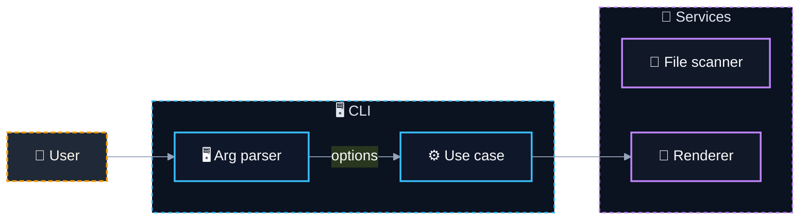

# 📝 @davidtorro/readme-gen

  

A CLI tool that generates professional README.md files for your projects using AI-powered templates. It analyzes your project structure and automatically creates a visually appealing README with badges, sections, and documentation links.

> 🤖 Generate beautiful, professional README.md files in seconds with AI-powered template generation.

## ⚙️ Tech Stack

- 🔤 **Languages**: TypeScript
- 🤖 **AI**: Ollama
- 🔧 **Tooling**: tsup

## ✨ Features

- 📦 **Project Analysis** - Automatically scans your project files and structure to extract relevant information
- 🤖 **AI-Powered Templates** - Uses Ollama to generate README content based on your project's characteristics
- 📝 **Markdown Output** - Produces clean, formatted README.md files with badges, sections, and documentation links
- 🌐 **Multilingual Support** - Includes English and Spanish language templates for README sections

## 🏗️ Architecture



| Component | Technology | Details |
| --- | --- | --- |
| `cli` | TypeScript | Parses arguments |
| `scanner` | Node.js | Reads project files |

## 🗂️ Project Structure

```
@davidtorro/readme-gen/
├── assets/                                  # Static assets
│   └── .gitkeep                             # Keep assets directory
├── src/                                     # Source code
│   ├── ai/                                  # AI-related code
│   │   ├── domain/                          # AI domain logic
│   │   │   └── ai-generator.port.ts         # AI generator port
│   │   └── infrastructure/                  # AI infrastructure
│   │       ├── ai.config.ts                 # AI configuration
│   │       └── ollama.client.ts             # Ollama client
│   ├── cli/                                 # Command line interface
│   │   └── cli.parser.ts                    # CLI argument parser
│   ├── project/                             # Project-related code
│   │   ├── domain/                          # Project domain logic
│   │   │   ├── project-scanner.port.ts      # Project scanner port
│   │   │   ├── project.builder.ts           # Project builder
│   │   │   ├── project.detectors.ts         # Project detectors
│   │   │   └── project.interfaces.ts        # Project interfaces
│   │   └── infrastructure/                  # Project infrastructure
│   │       └── fs-project-scanner.ts
│   ├── readme/                              # README generation code
│   │   ├── application/                     # README application layer
│   │   │   └── generate-readme.use-case.ts  # Generate README use case
│   │   └── domain/                          # README domain logic
│   │       ├── i18n/                        # i18n for README
│   │       │   ├── en.json                  # English i18n for README
│   │       │   ├── es.json                  # Spanish i18n for README
│   │       │   └── index.ts                 # i18n index for README
│   │       ├── readme.badges.ts             # README badges
│   │       ├── readme.categories.ts         # README categories
│   │       ├── readme.commands.ts           # README commands
│   │       ├── readme.interfaces.ts         # README interfaces
│   │       ├── readme.mermaid.ts            # README Mermaid diagrams
│   │       ├── readme.render.ts             # README rendering
│   │       ├── readme.sections.ts           # README sections
│   │       └── readme.tree.ts               # README file tree
│   └── main.ts                              # CLI entry point
├── .env.example                             # Environment variables example
├── .gitignore                               # Git ignore file
├── LICENSE                                  # License file
├── NOTICE                                   # Notice file
├── package-lock.json                        # Node package lock
├── package.json                             # Node package config
├── README.md                                # Project README
├── tsconfig.json                            # TypeScript config
└── tsup.config.ts                           # tsup build config
```

## 📦 Installation

```bash
npm install
```

## 🛠️ Scripts

- `npm run build` — `tsup`
- `npm run dev` — `tsup --watch`
- `npm run typecheck` — `tsc`
- `npm run prepublishOnly` — `npm run build`
- `npm run gen` — `npm run build && node dist/main.js`

## 📄 License

Apache-2.0
