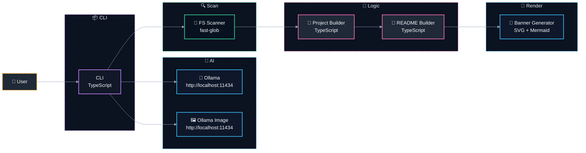

# 📝 @davidtorro/readme-gen

  

A README.md generator that creates professional and attractive READMEs quickly, with optional local AI enrichment for banner images and content.

> 🚀 Generates professional READMEs with AI-powered banners and content, all locally and without external dependencies.

## ⚙️ Tech Stack

- 🔤 **Languages**: TypeScript
- 🤖 **AI**: Ollama
- 🔧 **Tooling**: tsup

## ✨ Features

- Generates README.md with AI-enhanced banners and content using Ollama for local inference.
- Supports multiple languages (English and Spanish) with localized translations.
- Analyzes project structure and metadata from package.json and source files to build a comprehensive README.
- Includes customizable sections like badges, architecture diagrams, and tech stack categorization.
- Offers command-line interface (CLI) for generating READMEs with options for AI enrichment and banner customization.

## 🏗️ Architecture



| Component | Technology | Details |
| --- | --- | --- |
| `CLI` | TypeScript | Command-line interface for generating README |
| `FS Scanner` | fast-glob | Scans project files and dependencies |
| `Project Builder` | TypeScript | Builds project metadata from package.json |
| `README Builder` | TypeScript | Generates README content using i18n and AI |
| `Banner Generator` | SVG + Mermaid | Generates animated SVG banner with AI-generated logo |
| `Ollama` | Ollama | Text generation model for content creation |
| `Ollama Image` | Ollama | Image generation model for logo creation |

## 🗂️ Project Structure

```
@davidtorro/readme-gen/
├── assets/                                  # Static assets folder
│   └── banner.svg                           # Banner SVG image
├── src/                                     # Source code directory
│   ├── ai/                                  # AI-related functionality
│   │   ├── domain/                          # AI domain models and interfaces
│   │   │   ├── ai-generator.port.ts         # AI generator interface
│   │   │   ├── banner.prompt.ts             # Banner prompt definitions
│   │   │   └── image-generator.port.ts      # Image generator interface
│   │   └── infrastructure/                  # AI infrastructure implementations
│   │       ├── ai.config.ts                 # AI configuration
│   │       ├── ollama-image.client.ts       # Ollama image client
│   │       └── ollama.client.ts             # Ollama client
│   ├── cli/                                 # Command Line Interface
│   │   └── cli.parser.ts                    # CLI argument parser
│   ├── project/                             # Project-related functionality
│   │   ├── domain/                          # Project domain models and interfaces
│   │   │   ├── project-scanner.port.ts      # Project scanner interface
│   │   │   ├── project.builder.ts           # Project builder
│   │   │   ├── project.detectors.ts         # Project detectors
│   │   │   └── project.interfaces.ts        # Project interfaces
│   │   └── infrastructure/
│   │       └── fs-project-scanner.ts        # File system project scanner
│   ├── readme/                              # README generation logic
│   │   ├── application/                     # README application layer
│   │   │   └── generate-readme.use-case.ts  # Generate README use case
│   │   └── domain/                          # README domain models and interfaces
│   │       ├── i18n/                        # Internationalization files for README
│   │       │   ├── en.json                  # English i18n for README
│   │       │   ├── es.json                  # Spanish i18n for README
│   │       │   └── index.ts                 # i18n file index
│   │       ├── readme.architecture.ts       # README architecture section
│   │       ├── readme.badges.ts             # README badges section
│   │       ├── readme.banner.ts             # README banner section
│   │       ├── readme.categories.ts         # README categories section
│   │       ├── readme.commands.ts           # README commands section
│   │       ├── readme.interfaces.ts         # README interfaces
│   │       ├── readme.mermaid.ts            # README Mermaid section
│   │       ├── readme.render.ts             # README rendering logic
│   │       ├── readme.sections.ts           # README sections management
│   │       └── readme.tree.ts               # README tree structure
│   └── main.ts                              # Main application entry point
├── .env.example                             # Example environment variables
├── .gitignore                               # Git ignore configuration
├── LICENSE                                  # Project license file
├── NOTICE                                   # Project notice file
├── package-lock.json                        # NPM package lock file
├── package.json                             # NPM project configuration
├── README.md                                # Project README file
├── tsconfig.json                            # TypeScript configuration
└── tsup.config.ts                           # tsup build configuration
```

## 🛠️ Scripts

- `npm run build` — `tsup`
- `npm run dev` — `tsup --watch`
- `npm run typecheck` — `tsc`
- `npm run gen` — `npm run build && node dist/main.js`
- `npm run gen:all` — `npm run build && node dist/main.js banner --ai --force && node dist/main.js --ai --force`

## 🚀 Usage

Run it without installing, using npx:

```bash
npx @davidtorro/readme-gen
```

Or install it globally:

```bash
npm install -g @davidtorro/readme-gen
readme-gen
```

## 📋 Requirements

- Node.js `>=20`

## 📄 License

Apache-2.0
